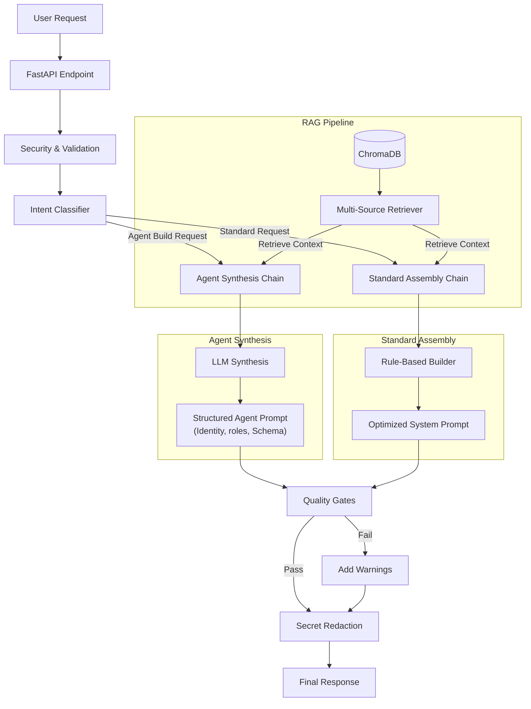

# Prompt RAG Agent

A production-ready Retrieval-Augmented Generation (RAG) system for generating high-quality, structured system prompts for downstream LLMs (Gemini, Claude, GPT).

This system specifically excels at:
- **Agentic Workflows:** Synthesizing complex multi-agent system prompts.
- **Skill Injection:** Dynamically retrieving and injecting specific capabilities (e.g., "Chain of Thought", "Structured Output") into prompts.
- **Security:** Validating inputs and detecting prompt injection attempts.

## System Workflow



## Features

### 🧠 Intelligent RAG Pipeline
- **Intent-Aware Retrieval**: Classifies requests (e.g., "Coding", "Agent Design") to retrieve the most relevant patterns.
- **Multi-Source Context**: Combines three knowledge sources:
  - **Patterns**: Best-practice templates for Agents, Coding, personas, etc.
  - **Skills**: Modular capabilities like "Chain of Thought", "Output Formatting".
  - **Guidelines**: Security and compliance rules (e.g., OWASP, PII handling).

### 🤖 Agent Synthesis (New!)
- **Dynamic Construction**: Automatically detects requests to build AI agents.
- **Architectural Generation**: Synthesizes complete multi-agent architectures including:
  - **Identity & Purpose**: Clear role definitions.
  - **Core Features**: Numbered, actionable capabilities.
  - **Data Schema**: JSON schemas for structured inter-agent communication.
  - **Default Roles**: Definitions for sub-agents (e.g., Researcher, Builder, QA).

### 🛡️ Enterprise-Grade Security
- **Prompt Injection Defense**: Heuristic and LLM-based detection of jailbreak attempts.
- **Secret Redaction**: Automated scrubbing of API keys and credentials from outputs.
- **Quality Gates**: Enforces minimum standards for prompt length, structure, and essential sections.

## Quick Start (Docker)

The easiest way to run the full stack (Backend + Frontend + Vector Store).

```bash
# 1. Clone the repository
git clone <repository-url>
cd prompt

# 2. Configure Environment
cp .env.example .env
# Edit .env and add your GOOGLE_API_KEY

# 3. Build and Run
docker-compose up --build
```

Access the application:
- **Frontend UI**: [http://localhost:3000](http://localhost:3000)
- **API Documentation**: [http://localhost:8000/docs](http://localhost:8000/docs)

## Usage Examples

### 1. Generating a Coding Assistant
**URL**: `POST /generate-prompt`
```json
{
  "user_request": "I need a Python expert to help me write a FastAPI backend",
  "target_model": "gemini",
  "prompt_style": "detailed",
  "output_format": "markdown"
}
```

### 2. Synthesizing a Planning Agent
**URL**: `POST /generate-prompt`
```json
{
  "user_request": "Create a TaskGraph Planner agent that breaks down goals into dependency trees",
  "target_model": "gemini",
  "prompt_style": "detailed"
}
```
*The system will detect the "Agent" intent and generate a specialized prompt with JSON schemas and role definitions.*

### 3. Ingesting New Knowledge
**URL**: `POST /admin/ingest`
```json
{
  "title": "New Skill: Rust Programming",
  "doc_type": "skill_card",
  "content": "Description of Rust best practices...",
  "version": "1.0"
}
```

## Project Structure

```
prompt/
├── backend/
│   ├── main.py              # Application entry point
│   ├── config.py            # Settings & Environment variables
│   ├── agent/               # Core Logic
│   │   ├── chain.py         # Main RAG & LLM Orchestration
│   │   ├── prompt_builder.py# Dynamic Prompt Assembly
│   │   ├── retriever.py     # Knowledge Retrieval
│   │   └── quality_gates.py # Output Validator
│   ├── seed_data/           # Initial Knowledge Base (Markdown/YAML)
│   └── vectorstore/         # ChromaDB Interface
└── frontend/
    ├── pages/               # Next.js Pages
    └── components/          # React UI Components
```

## Knowledge Base

The system comes pre-seeded with industry best practices:
- **Guidelines**: OpenAI/Anthropic/Google prompt engineering rules.
- **Patterns**: Multi-agent design, System prompt templates.
- **Skills**: Chain-of-Thought, Few-Shot Prompting, Structured Output generation.

## License

MIT
